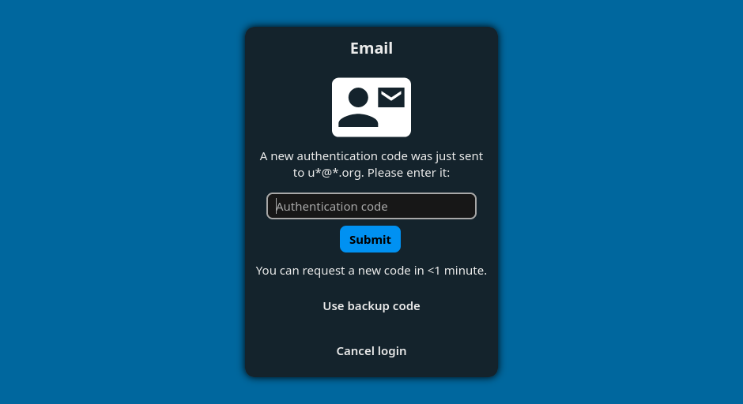

# Two-Factor Email Provider for Nextcloud

[Nextcloud](https://nextcloud.com/) can ask for a second factor after the password ([two-factor authentication](https://en.wikipedia.org/wiki/Multi-factor_authentication#Factors), 2FA). Each kind of second factor comes from a provider app that a server admin installs. This one emails a one-time code (OTP) — six digits by default — and asks for it on a second login page.

## Installation and setup

An admin installs **Two-Factor Email** from the [Nextcloud app store](https://apps.nextcloud.com/apps/twofactor_email) and enables it. The server needs a working mail setup — the code travels by email.

A user then switches it on under *Personal settings › Security*, which needs an email address in *Personal info*. An admin can switch it on for someone instead: `occ twofactorauth:enable <uid> email`.

Nextcloud can also enforce a second factor for everyone or per group, though never one particular method. Email is a low-friction choice there: the user confirms one code and is done, with no device to enrol. Check first that every account has a working address — a user whose address does not work cannot log in.

Any second factor stops desktop and mobile clients from signing in with the normal password. Each of them needs an [app password](https://docs.nextcloud.com/server/stable/user_manual/en/session_management.html) instead.

The [user guide](doc/users.md) and the [administrator guide](doc/admins.md) cover all of this in detail.

## Supported versions

| Nextcloud | App | Security fixes | New features | App EOL |
|---|---|---|---|---|
| 35 | **3.5** | ✅ | ✅ | – |
| 34 | **3.5** | ✅ | ✅ | – |
| 33 | **3.5** | ✅ | ✅ | – |
| 32 | 3.3 | ✅ | ⚠️ | – |

This table is the promise. It changes with every release, and the CHANGELOG says when a line's support ends. ⚠️ means best effort.

An upgrade from version 2 of this app keeps the provider switched on for each user; stored codes are not carried over, as they expire within minutes anyway.

## Documentation

- Guides [for users](doc/users.md), [for administrators](doc/admins.md), and [for developers](doc/developers.md)
- The [architecture](doc/architecture.md) and the [threat model](doc/threat-model.md)

To report a security vulnerability, see [SECURITY.md](SECURITY.md).

## Contributions welcome

This app is a community effort. Help of any kind is welcome — code, tests, documentation, translations, bug reports and ideas.

[CONTRIBUTING.md](CONTRIBUTING.md) explains how to get started; [CONTRIBUTORS.md](CONTRIBUTORS.md) lists who to ask. Planned work is in the [roadmap](https://github.com/datenschutz-individuell/twofactor_email/issues/7), open ideas in the [idea collection](https://github.com/datenschutz-individuell/twofactor_email/issues/8).

## Building yourself

To build the app, check out the repo and use `krankerl package` or follow these steps:

* `composer i --no-dev`
* `npm ci`
* `npm run build` or `npm run dev` [more info](https://docs.nextcloud.com/server/stable/developer_manual/digging_deeper/npm.html)

[krankerl](https://github.com/ChristophWurst/krankerl/) is the tool proposed by Nextcloud to build apps.
