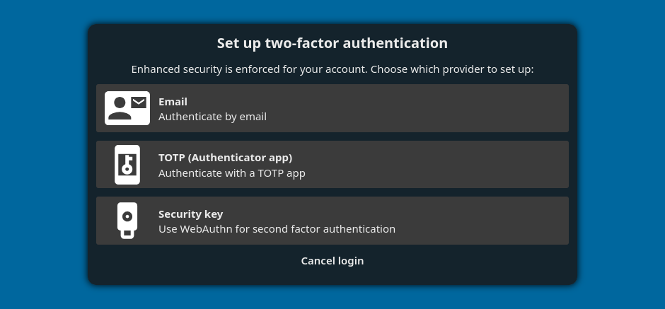
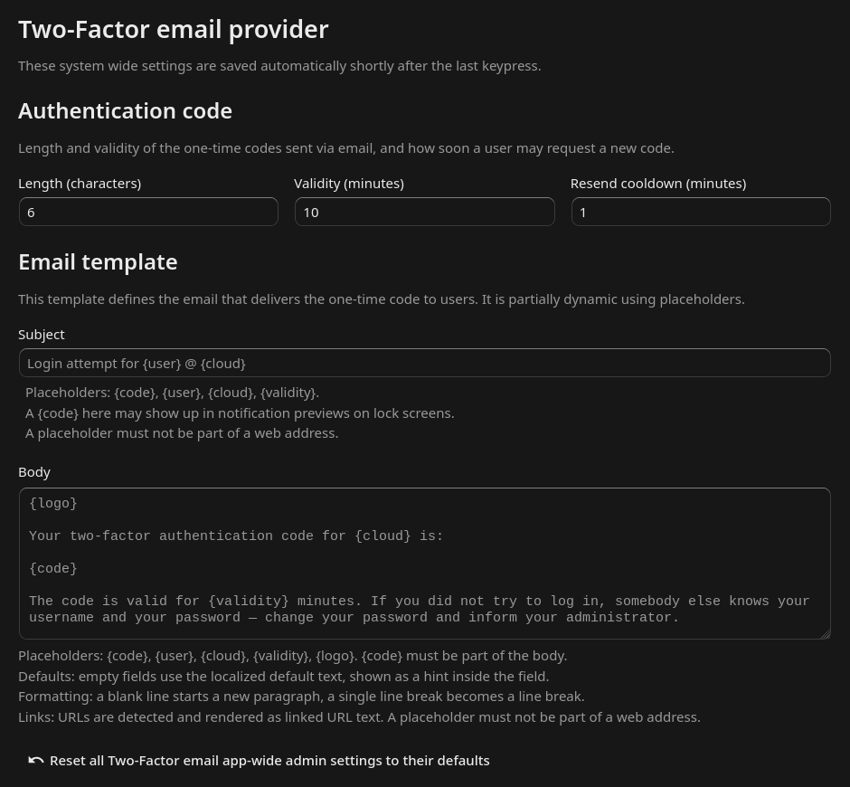

# For administrators

This page covers installing, configuring, and running the provider.

## Installing & enabling

- Install **Two-Factor Email** from the [Nextcloud App Store](https://apps.nextcloud.com/apps/twofactor_email). The server needs a working, configured mail server: the second factor travels over your mail path, so use TLS to that server and treat it as part of your security perimeter.
- Users can enable it themselves in their security settings, or you can enable/disable it per user via `occ` — see [From the command line](#from-the-command-line).
- You can also **enforce 2FA** server-wide or per group (a Nextcloud feature) — see [Enforcing two-factor authentication](#enforcing-two-factor-authentication).

## From the command line

The app brings three commands of its own:

- `twofactor_email:settings` — show/change the app settings.
- `twofactor_email:delete-codes` — delete the stored code of one user or all.
- `twofactor_email:cleanup` — delete expired codes (also run daily by a background job).

Everything else is done with Nextcloud's own commands, and there are **two ids that are easy to mix up**: the app is `twofactor_email`, the provider inside it is `email`.

```shell
occ app:list --enabled | grep twofactor  # is the app installed and on?
occ app:enable twofactor_email           # make the provider available on the server
occ app:disable twofactor_email          # remove it again — see the note below
occ twofactorauth:state <uid>            # which providers are on for this account
occ twofactorauth:enable <uid> email     # switch email 2FA on for that account
occ twofactorauth:disable <uid> email    # switch it off again
```

The last two work because this provider allows changes by an admin. A provider that does not allow it replies *The provider does not support this operation* and exits with code 2 — version 2 of this app was such a provider, version 3 is not. The admin manual describes the commands under [Two-factor authentication](https://docs.nextcloud.com/server/stable/admin_manual/occ_users.html#two-factor-authentication).

### Scripting

To switch the provider on for many accounts, use a loop. This one prints every account for which Nextcloud reports no enabled provider:

```shell
occ user:list --limit 0 --output=json | jq -r 'keys[]' | while IFS= read -r uid; do
    occ twofactorauth:state "$uid" </dev/null | grep -q '^Two-factor authentication is enabled' || echo "$uid"
done
```

- `occ twofactorauth:state` calls backup codes an enabled provider, while the login does not accept them as the only factor. An account with nothing but backup codes is therefore not printed, yet is still sent through the setup step.
- A user id may contain spaces, so the loop reads the ids line by line. Splitting them on whitespace would turn one account into two ids that do not exist.
- `occ user:list` stops at **500 accounts** unless you pass `--limit 0`. The loop calls `occ` once per account, so on a large instance it runs for minutes.
- **Switch the provider on only for accounts that have an address.** Nothing checks this when you switch it on, and an account without one cannot complete the code step. `occ user:info <uid>` prints the address, but only the system one — see [Email addresses](#email-addresses) for the second address an account can hold.
- A change made **by an admin** reaches the user as a notification. Every change lands in the user's activity list, whoever made it.

### Removing the app

**Switch the provider off for every account before you remove the app.** Nextcloud keeps the association, and once the app is gone the per-account command cannot remove it any more — those users then see *Could not load at least one of your enabled two-factor auth methods* at every login. What still works without the app is `occ twofactorauth:cleanup email`, which drops the association for everyone at once. That cannot be undone.

## Enforcing two-factor authentication

Enforcement belongs to Nextcloud, not to this app: *Administration settings › Security*, or

```shell
occ twofactorauth:enforce                                   # show the current state
occ twofactorauth:enforce --on
occ twofactorauth:enforce --on --exclude=bots
occ twofactorauth:enforce --on --group=staff
occ twofactorauth:enforce --off
```

Both options can be repeated for several groups. Naming groups with `--group` makes `--exclude` pointless: once a list of enforced groups exists, the exclusions are no longer looked at, and a user in both lists has to use 2FA. The [admin manual](https://docs.nextcloud.com/server/stable/admin_manual/configuration_user/two_factor-auth.html#enforcing-two-factor-authentication) explains the group logic.

Nextcloud cannot enforce one **specific** method. But **if this app is the only provider that offers setup at login, enforcing 2FA does enforce email 2FA**: (backup codes are installed on every server, and they do not offer that step.) a user without a second factor is sent through a setup step at the next login, and this provider supports that step — the user confirms one code and is done, with no device to enrol and nothing to install. That is what makes email the practical choice for enforcement. The price is the other side of the same choice: every account needs a working address before you switch enforcement on, because a user whose only factor is email and whose address does not work is locked out. Where that is a risk, keep [another provider](https://docs.nextcloud.com/server/stable/user_manual/en/user_2fa.html) installed and accept that enforcement is then no longer email-specific.



## Email addresses

The code goes to the address Nextcloud holds for the account, so where that address comes from is part of your login security:

- **Fill it from your directory.** With the LDAP backend, *Email Field* maps an attribute (usually `mail`) to the Nextcloud address, and the value is refreshed from the directory on every login. See [Special attributes](https://docs.nextcloud.com/server/stable/admin_manual/configuration_user/user_auth_ldap.html#special-attributes).
- **Keep users from changing it.** `allow_user_to_change_email` in `config.php` stops users editing the *system* address; adding a further address and picking it as the primary one stays possible, so this does not decide where the code goes. It defaults to whatever [`allow_user_to_change_display_name`](https://docs.nextcloud.com/server/stable/admin_manual/configuration_server/config_sample_php_parameters.html#allow-user-to-change-display-name) is set to.
- **Set it from a script.** `occ user:setting <uid> settings email <address>`, or the [provisioning API](https://docs.nextcloud.com/server/stable/admin_manual/configuration_user/user_provisioning_api.html).

An account can hold a **second** address, though: users may add further addresses to their profile, verify them, and pick one as their primary address — and the primary one is where the code goes. So correcting the system address is not always enough. `occ user:setting <uid> settings` shows both.

**An address that disappears switches the factor off — but only when that is safe.** Every path that clears the *system* address tells the app: the personal settings, the users page, the provisioning API and `occ user:setting`. (A directory sync never clears it: the LDAP backend ignores an empty or missing attribute rather than writing it through.) If the account still has another second factor, the app switches email 2FA off. If email was the only one, it stays on and every login fails until the address is back or you run `occ twofactorauth:disable <uid> email`.

Two cases get past this. Deleting the *additional* address a user had picked as their primary one fires no event at all, so the app learns nothing: delivery falls back to the system address, or stops when the account has none. And the app counts backup codes as another second factor, while the login does not accept them as the only one — an account whose sole other factor is backup codes therefore ends up password-only once its address is gone.

## Settings

Code length, code validity, the resend cooldown, and the challenge email subject/template are configurable — from the admin UI **and** via `occ`. All values go through one validator with fixed bounds (length, validity, cooldown ranges; subject/template max length; CR/LF rejected in the subject), so neither the admin UI nor `occ twofactor_email:settings` can store an out-of-range or malformed value. The generic `occ config:app:set` writes to the app config directly and is not bound by that validator — see the read-side bounds below.



**A placeholder must not sit inside a web address.** `https://example.com/{code}` in the subject or the body is rejected, because the value would become part of the link — and link scanners fetch such addresses on their own, which would hand the one-time code to whoever owns that address. Should such a text already be stored, it is kept and reported: before every mail the finished text is checked once more, and if the code ended up in a web address the mail is sent with the default text instead. So no code leaves in a link. The admin settings page then refuses to save anything until the text is fixed, because the page saves all fields together — use `occ twofactor_email:settings` to change another setting first, or fix the text there.

**The three numeric settings are also bounded when they are read**, not only when they are written. `occ config:app:set twofactor_email …` writes past this app's validation, so a value outside the allowed range is corrected to the nearest valid one at use time; the app never generates a code shorter than the minimum. `occ twofactor_email:settings` shows the value that is in effect, so a corrected one looks like a plain setting there; the correction itself is reported in the Nextcloud log and, once, in the output of `occ upgrade`.

Abuse of the "resend code" action is limited both by the app's own resend cooldown and by Nextcloud's **per-user rate limit and brute-force protection**.

## When no code arrives

The challenge page says whether the app got that far: it names a missing address, or a mail that could not be sent. Both are written to the log under `twofactor_email`, and the entry says which of the two it was. Why the mail server refused the address is not in it — Nextcloud logs that itself, under `core` for a transport error and only at debug level for an address it cannot parse.

If the page instead says a code was sent and none arrives, the mail left Nextcloud — look at your mail server and at the spam folder. Worth checking on the account itself: `occ user:setting <uid> settings` lists both addresses an account can hold, and the code goes to the primary one if the user picked one, to the system address otherwise — see [Email addresses](#email-addresses). Reading only one of the two can point at the wrong mailbox.

## Frequently asked questions

**Can I enforce email 2FA specifically?**
Not directly — Nextcloud enforces *a* second factor, never a particular one, and no provider can change that. Installing this provider and no other gets you the same result — see [Enforcing two-factor authentication](#enforcing-two-factor-authentication).

**Can I switch the provider on for everyone, or for every new account?**
For everyone, loop over `occ user:list` and call `occ twofactorauth:enable` — see [Scripting](#scripting). For new accounts Nextcloud has no setting for it, and this app deliberately does not switch itself on: at that moment the address is usually unverified, and the invitation mail and the codes travel the same path anyway, so it would add no security.

**Can a user receive their codes at some other address than their Nextcloud one?**
No, and that is a decision, not an omission. A second address is one more value to validate, store and keep in sync, and whoever reads a mailbox can also request a password reset there. If email is not a safe enough channel for an account, use another provider for it.

**A user cannot reach their mailbox any more. How do I let them in?**
Put the codes where the user can read them: `occ user:setting <uid> settings email <address>`. `occ twofactorauth:disable <uid> email` looks like the shorter way and is the wrong one where 2FA is enforced — the next login sends the user through the setup step, and this provider is usually the only one offering it, so they are asked for a code at the same unreachable mailbox. Switching the factor off also removes the *Use backup code* link, which the login screen shows only while a second factor is enabled. So if the account has backup codes, leave the factor on and let the user log in with one. If the factor really has to go, take the account out of enforcement first. The [Two-Factor Admin Support](https://apps.nextcloud.com/apps/twofactor_admin) app is another way to help such a user.

**Do users have to confirm a code at every login?**
Yes, once per login — but not for every action afterwards: the session stays valid. *Stay logged in* is the exception: Nextcloud then keeps a cookie, valid for 15 days unless `remember_login_cookie_lifetime` says otherwise, and a session restored from that cookie asks for no second factor. Logging out drops it. What Nextcloud does not have is a *trusted device* a user can register; that would be a server feature, not something a provider can add.

**Our desktop and mobile clients stopped working.**
That happens with any second factor: those apps cannot show the web login. Each of them needs an app password, created under *Personal settings › Security › Devices & sessions*.

**After an update the mail lost its logo or its line breaks.**
An older version saved the default text into the settings like a text of your own, so later improvements to the default never reached those instances. Clear the field in the admin settings, or run `occ twofactor_email:settings email_template ""`; the same works for `email_subject`.

**Should I put `{code}` in the subject?**
Better not. Mail clients show subjects in system notifications, which are readable on a locked screen — a code in the subject can be read there without unlocking the device.
