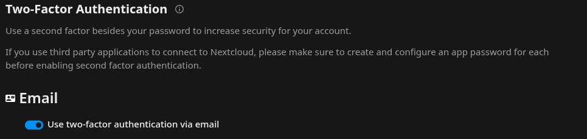
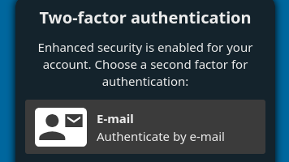
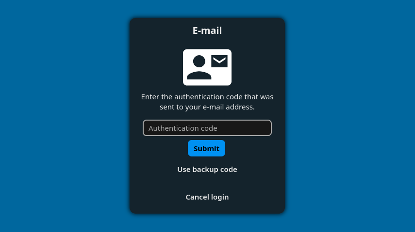

# For users

Two-factor email adds a second step to your Nextcloud login: after your password, you confirm a short code that was sent to your email address. This page explains how to turn it on, how to use it, and how it keeps your account safe.

## Turning it on

- Set a primary email address in *Personal info* first — the code is sent there.
- Enable **Email** under *Personal settings › Security › Two-Factor Authentication*.
- From then on, each login asks for a code after your password.

## Using it at login

When you sign in, you enter your username and password as usual. If email is your only second factor, you go straight to the code step; if you have several methods enabled, Nextcloud first asks which one to use — choose **Email verification**:

The app then emails you a short one-time code and shows the code-entry screen. Your address is displayed masked, so a bystander cannot read it. Enter the code to finish signing in:

If the email does not arrive, request a fresh one with **Send a new code** after a short cooldown. Each code is single-use and only one is valid at a time, so reloading the page never floods your inbox.

## Desktop and mobile apps

Once any 2FA is active, apps that cannot show the web login — most desktop and mobile sync clients — can no longer sign in with your normal password. The Nextcloud manual covers this under [*Using client applications with two-factor authentication*](https://docs.nextcloud.com/server/stable/user_manual/en/user_2fa.html#using-client-applications-with-two-factor-authentication): you generate a **device-specific password** (also called an *app password*) for each such app and use that instead.

Create them under *Personal settings › Security › Devices & sessions* — see [Manage connected browsers and devices](https://docs.nextcloud.com/server/stable/user_manual/en/session_management.html). One thing specific to email 2FA: an app password skips the second step entirely, so treat each one like a full password — give every device its own, name them clearly, and revoke any you no longer use.

## What protects your codes

- Codes are **randomly generated** and **short-lived** — your admin sets how long they stay valid (for example 10 minutes).
- A code is **single-use**: once it logs you in, it is gone.
- Only **one** code is valid at a time. Reloading the login page does **not** send you a flood of new emails.
- The server never keeps your actual code — only a one-way **fingerprint** (hash) of it, so the code cannot be read back out of the system.
- On the login screen your address is shown **masked** (like `a*@*.com`), so someone glancing at your screen does not learn your full email address.
- Turning email 2FA **on or off** asks for your password again.

## Good to know

- Your codes arrive **by email**, so this factor is only as safe as your **mailbox**. Protect your email account with a strong, unique password and, ideally, its own second factor — or a passkey.
- Like authenticator-app codes, an emailed code is **not phishing-proof**: a fake login page could ask you for the code and use it immediately. **Only ever enter a code on your genuine Nextcloud address.**
- If you want the strongest protection, ask your admin whether a hardware security key or passkey (FIDO2/WebAuthn) is available — it resists phishing that codes cannot. Nextcloud lets you enable [several methods](https://docs.nextcloud.com/server/latest/user_manual/en/user_2fa.html) at once, so you can keep email as a fallback.

For how email 2FA compares to other methods and where its limits are, see the [threat model](threat-model.md).

## Not receiving a code?

- Check that your **primary email address** in *Personal info* is correct and that you can receive mail there.
- Look in your spam/junk folder.
- If mail delivery on the server is broken you will not receive codes — contact your administrator. Consider setting up a second 2FA method as a backup.
